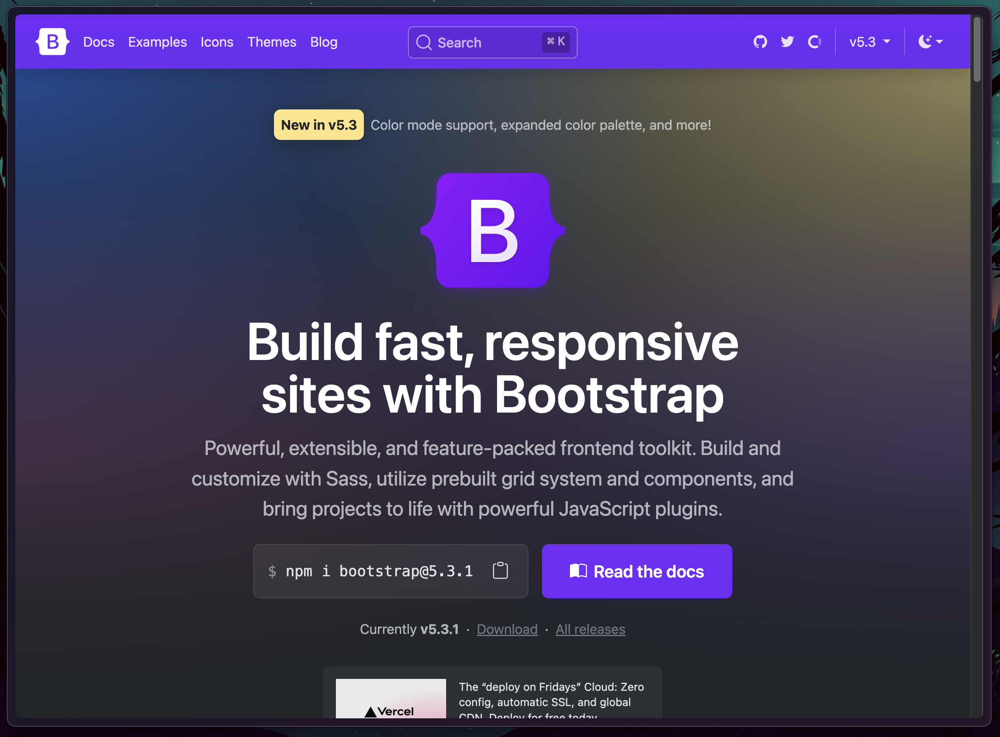
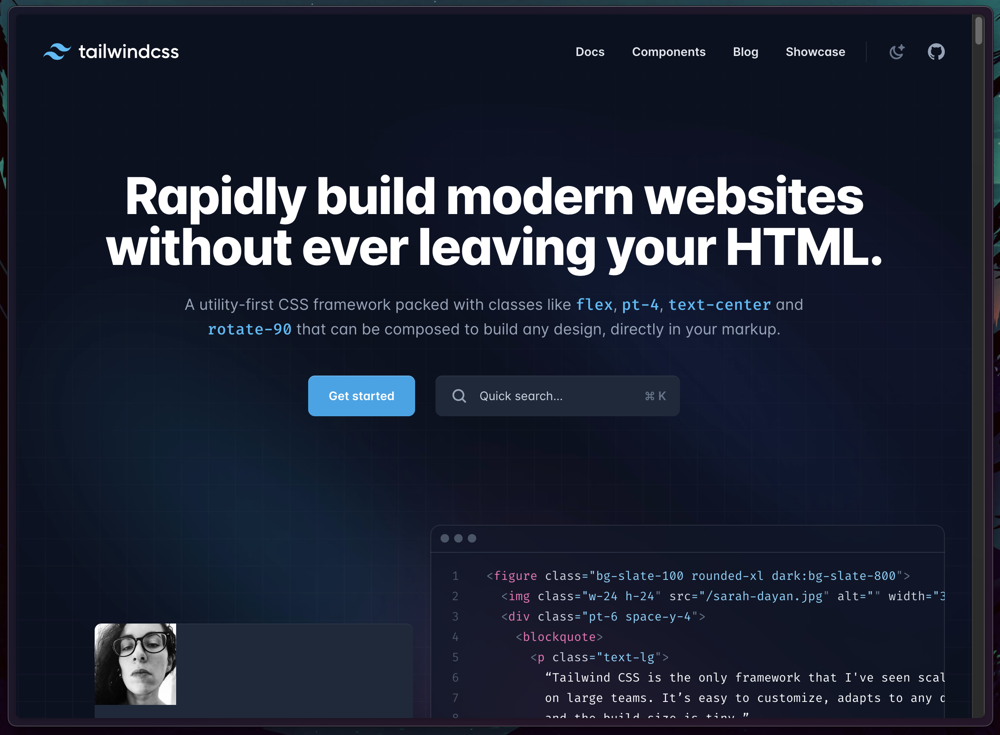
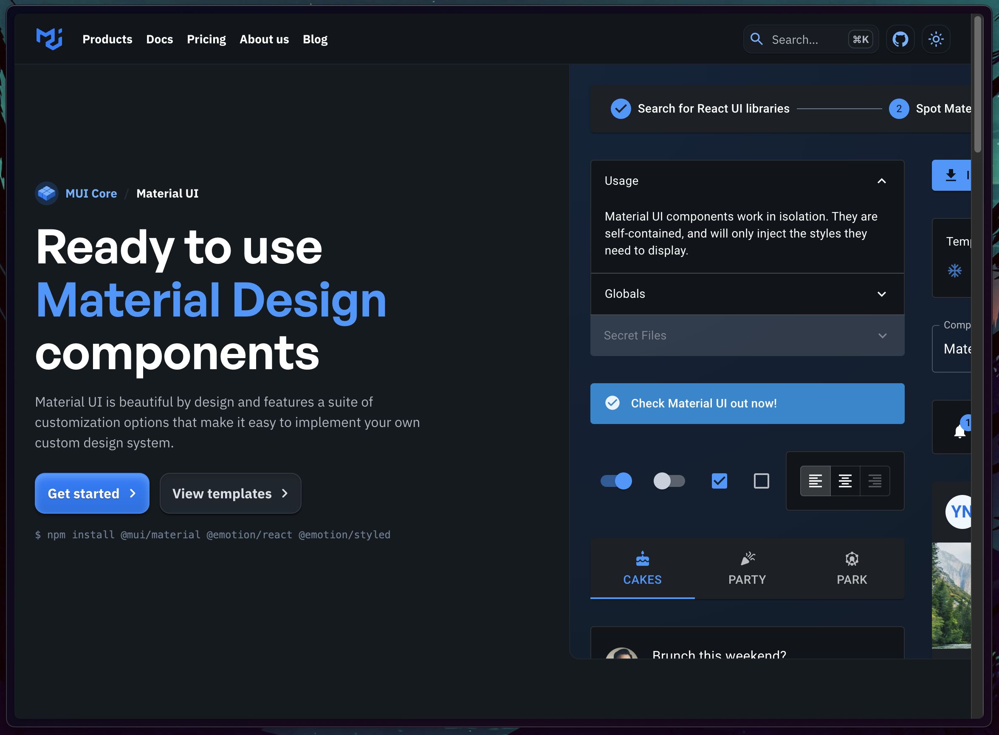
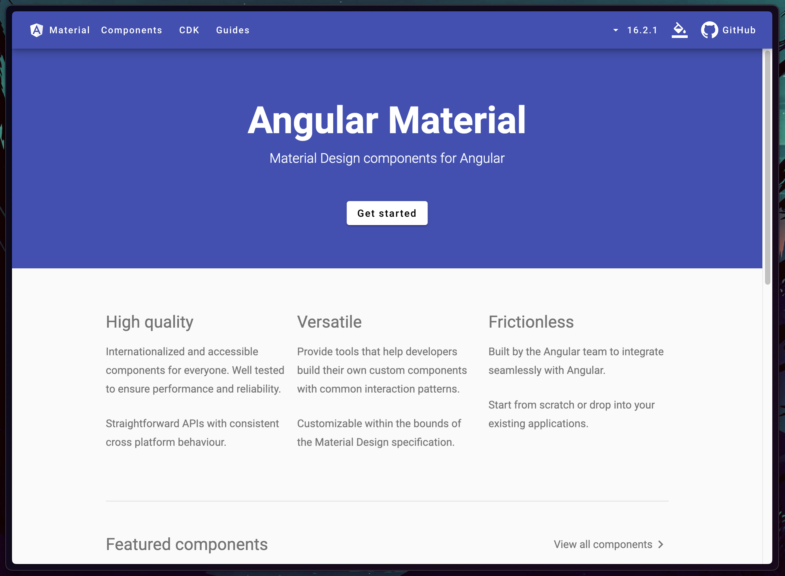

# Frontend-Frameworks

## Inhalt

* [Intro](#intro)
* [Vor- & Nachteile](#vor---nachteile)
* [Bekannte Frameworks](#bekannte-frameworks)
* [Angular & React spezifische Frameworks](#angular--react-spezifische-frameworks)
* [Wahl eines geeigneten Frontend-Frameworks](#wahl-eines-geeigneten-frontend-frameworks)

## Intro

Frontend-Frameworks sind ein **Werkzeugkasten**, der in der Regel aus einer Ansammlung von Komponenten aus HTML-, CSS- und JS-Bausteinen besteht.  

**Frontend-Framework ≠ JavaScript-Framework**

## Vor- & Nachteile

### Vorteile

* **Rapid Prototyping** &rightarrow; Viele Frameworks bieten vorgefertigte Komponenten an, die schnell einsatzbereit sind.
* **Browser-Support** &rightarrow; Die Browser-Unterstützung ist in der Regel sehr gut, da bereits andere Entwickler die Kompatibilität berücksichtigt haben.
* **Community** &rightarrow; Die meisten Frameworks verfügen über eine eigene Community, die bei Problemen konsultiert werden kann.

### Nachteile

* **Code Bloat** &rightarrow; In der Regel muss mehr Code importiert werden, als tatsächlich genutzt wird.
* **Architecture** &rightarrow; Oft sind CSS-Selektoren und zum Beispiel JS-Libraries vorgegeben und müssen genutzt werden.
* **Lernkurve** &rightarrow; Aufgrund der hohen Komplexität erfordert das Erlernen des Frameworks oft eine beträchtlich viel Zeit.

## Bekannte Frameworks

### Bootstrap

Website: [getbootstrap.com](https://getbootstrap.com/)

### Tailwind

Website: [tailwindcss.com](https://tailwindcss.com/)  
Tailwind UI: [tailwindui.com](https://tailwindui.com/)

**Weitere Frontend-Frameworks**

* [Foundation](https://get.foundation/)
* [Material Design Lite](http://getmdl.io)
* [Pure.css](http://purecss.io)
* [Semantic UI](http://semantic-ui.com/)
* etc.

## Angular & React spezifische Frameworks

### Material UI for React

Website: https://material-ui.com/  
Getting Started: https://material-ui.com/getting-started/installation/

### Angular Material

Website: https://material.angular.io/  
Getting started: https://material.angular.io/guide/getting-started

**Weitere Frontend-Frameworks**

React
* [Headless UI](https://headlessui.dev/)
* [React Bootstrap](https://react-bootstrap.github.io/)
* [Semantic UI](https://react.semantic-ui.com/)
* [React Toolbox](http://react-toolbox.io)
* [Onsen UI](https://onsen.io/react/)
* etc.

Angular
* [Prime NG](https://www.primefaces.org/primeng/#/)
* [NG Bootstrap](https://ng-bootstrap.github.io/#/home)
* [Onsen UI](https://onsen.io/angular2/)
* etc.

## Wahl eines geeigneten Frontend-Frameworks

* **Architektur** &rightarrow; Passt das gewählte Framework zu eurem Projekt?
* **Funktionsumfang** &rightarrow; Habt ihr alles, was ihr benötigt?
  * **Modularisierung** &rightarrow; Könnt ihr selektiv entscheiden, was in euer Projekt importiert wird, und was nicht?

> **Das Wichtigste in Kürze**
>  
> * Frontend-Frameworks dienen dazu, die Arbeit für Entwickler zu vereinfachen und einem neuen Projekt einen gewissen Startschub zu geben.
> * Sie bieten in der Regel eine Vielzahl von Komponenten an, die genutzt werden können.
> * Die Entscheidung, ein Frontend-Framework einzubinden, ist oft eine wichtige, die auch Nachteile mit sich bringen kann (z.B. festgelegte CSS-Namenskonventionen).
> * JavaScript-Libraries und Frameworks haben oft ihre eigene spezifische Implementierung eines Frontend-Frameworks.

## Practice 🔥

Learning by doing

- [ ] Überlegt anhand der Kriterien, ob ihr ein Framework in eurem Projekt nutzen wollt
  - [ ] Falls ja, folgt dem Getting started guide um es in euer Projekt einzubinden

Zeit: ~ ♾️ min
