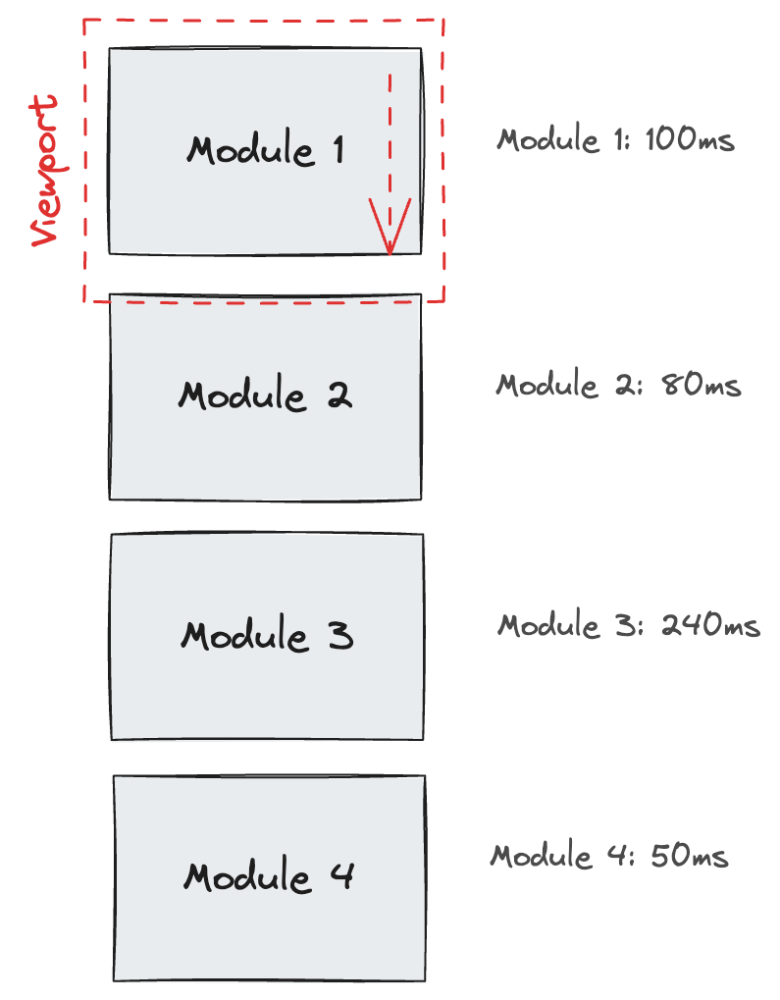
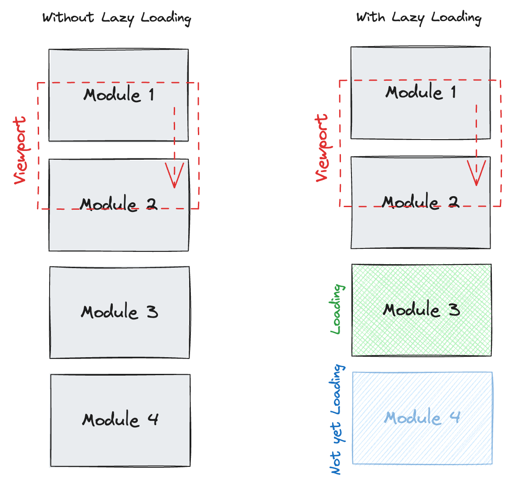
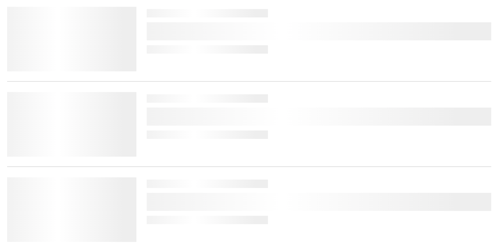

# Ladeverhalten / Lazy Loading mit React

## Inhalt

* [Das Problem](#das-problem)
* [Lazy Loading](#lazy-loading)
* [Lazy Loading in React](#lazy-loading-in-react)
* [Alles kombinieren](#alles-kombinieren)
* [Zusammenfassung](#zusammenfassung)

## Das Problem

Unsere Webseiten/Apps enthalten viele Komponenten. Wenn ein Nutzer unsere Webseite/App besucht, muss er warten, bis alles geladen, geparst und ausgeführt ist. Das kann besonders bei langsamen Internetverbindungen und älteren Geräten sehr lange dauern. Das ist nicht nur schlecht für die Benutzererfahrung. Je länger die Ladezeit, desto höher die Absprungrate. Das ist schlecht für die Conversion-Rate und ebenfalls für SEO, da bei SEO die [Core Web Vitals](https://web.dev/explore/learn-core-web-vitals) ebenfalls eine Rolle spielen.

Zudem gibt es bei Webseiten/Apps auf interne Kommunikation zwischen verschiedenen Services (z.B. speziell beim SSR). Wenn ein Service langsam ist, kann das die Performance der gesamten App beeinträchtigen. Das kann zum Beispiel passieren, wenn ein Service eine langsame Datenbankabfrage macht. Die App muss dann warten, bis die Datenbankabfrage fertig ist, bevor sie weitermachen kann. Das kann zu langen Ladezeiten führen.



## Lazy Loading

### Was ist Lazy Loading?

Lazy Loading ist eine Technik, bei der Ressourcen wie Bilder oder JavaScript erst dann geladen werden, wenn sie tatsächlich benötigt werden, zum Beispiel wenn sie im sichtbaren Bereich des Benutzers erscheinen (Viewport). Dies hilft, die Ladezeiten von Webseiten zu verkürzen und die Benutzererfahrung zu verbessern, indem unnötiges Laden grosser Dateien initial vermieden wird.



### IntersectionObserver

Der `IntersectionObserver` ist eine JavaScript-API, die es ermöglicht, das Eintreten und Verlassen eines HTML-Elements im Viewport zu überwachen. Wir können damit gezielt Aktionen auslösen, wenn ein Element in den Viewport eintritt oder diesen verlässt.

```html
<div class="page page-1">
  <h1>Page 1</h1>
</div>
<div class="page page-2">
  <h1>Page 2</h1>
</div>
<div class="page page-3">
  <h1>Page 3</h1>
</div>
<div class="page page-4">
  <h1>Page 4</h1>
</div>
```

```js
// Create the IntersectionObserver instance
// We provide a callback that is run when the Observer detects a change 
// (and when an element is first observed)
const observer = new IntersectionObserver((entries) => {
  // entries contains all IntersectionObserver Entries where a change was detected
  entries.forEach(entry => {
    // Toggles the class in-view, depending on entry.isIntersecting
    entry.target.classList.toggle("in-view", entry.isIntersecting)
  })
})

// Tell our IntersectionObserver to observe our elements
document.querySelectorAll(".page").forEach(page => {
  observer.observe(page);
})
```

**Demo** 🤯

- [IntersectionObserver Basic](https://codesandbox.io/s/2sk7t8?file=/src/index.mjs)

#### [`rootMargin`](https://developer.mozilla.org/en-US/docs/Web/API/IntersectionObserver/IntersectionObserver#rootmargin)-Option

Die `rootMargin`-Option lässt uns einen Offset definieren, der auf das Element angewendet wird. Dies kann genützt werden, um dem `IntersectionObserver` zu sagen, er sollte das Callback bereits vorher ausführen, bevor es den Viewport tatsächlich betritt. Das Element gilt dann zu diesem Zeitpunkt bereits als `isIntersecting`.

```js
const observer = new IntersectionObserver((entries) => {
  entries.forEach(entry => {
    entry.target.classList.toggle("in-view", entry.isIntersecting);
  });
}, {
  // Element is considered intersecting 200px before it enters the viewport
  // This works for both directions (top and bottom)
  rootMargin: "200px",
});
```

**Demo** 🤯

🚧 Codesandbox hat Probleme mit `rootMargin`.
Um den Effekt zu sehen, muss man das Sandbox-Resultat in einem neuen Fenster öffnen.

- [IntersectionObserver rootMargin (Sandbox)](https://codesandbox.io/s/28rdfr?file=/src/index.mjs)
- [IntersectionObserver rootMargin (Resultat)](https://28rdfr.csb.app/)

#### [`threshold`](https://developer.mozilla.org/en-US/docs/Web/API/IntersectionObserver/IntersectionObserver#threshold)-Option

Die `threshold`-Option lässt uns definieren, wie viel Prozent des Elements im Viewport sein muss, damit es als `isIntersecting` gilt. Die Option kann auch ein Array von Werten enthalten, um mehrere Schwellenwerte zu definieren.

```js
const observer = new IntersectionObserver((entries) => {
  entries.forEach(entry => {
    entry.target.classList.toggle("in-view", entry.isIntersecting);
  });
}, {
  // Element is considered intersecting even when only one pixel is visible.
  // This is the default value.
  threshold: 0,

  // Element is considered intersecting when 25% of it is visible.
  threshold: 0.25,

  // Element is considered intersecting when 99% of it is visible.
  threshold: 0.99,
});
```

**Demo** 🤯

- [IntersectionObserver threshold](https://codesandbox.io/s/d2xxff?file=/src/index.mjs)

#### Einmalige Intersection

Der `IntersectionObserver` kann auch so konfiguriert werden, dass er nur einmalig ein Element beobachtet. Sobald das Element das erste mal den Viewport betritt, wird es nicht mehr beobachtet.

```js
const observer = new IntersectionObserver((entries, observer) => {
  entries.forEach(entry => {
    entry.target.classList.toggle("in-view", entry.isIntersecting);
    console.log({ element: entry.target.className, isIntersection: entry.isIntersecting});

    // Stop observing the element, once it is intersecting
    if(entry.isIntersecting) {
      console.log(`No longer observing ${entry.target.className}`);
      observer.unobserve(entry.target);
    }
  });
}, {
  threshold: 0.25,
});

document.querySelectorAll(".page").forEach(page => {
  observer.observe(page);
});
```

**Demo** 🤯

- [IntersectionObserver Once](https://codesandbox.io/s/ldppv2?file=/src/index.mjs)

> **Das Wichtigste in Kürze**
>  
> * Der `IntersectionObserver` lässt uns ein Callback ausführen, wenn ein Element in den Viewport eintritt oder diesen verlässt
> * Wir können den `IntersectionObserver` so konfigurieren, dass er das Callback bereits ausführt, bevor das Element den Viewport betritt
> * Wir können mit dem Threshold definieren, wie viel Prozent des Elements im Viewport sein muss, damit es als `isIntersecting` gilt
> * Der `IntersectionObserver` kann für alle möglichen Sideeffects genutzt werden, auch zum Beispiel für das Tracking

**Hilfreiche Links**

* [IntersectionObserver](https://developer.mozilla.org/en-US/docs/Web/API/IntersectionObserver)

### Lazy Loading in action

Mit dem `IntersectionObserver` ist es jetzt möglich, Lazy Loading zu implementieren. Wir können damit verschiedene Ressourcen wie JavaScript-Module, Daten oder auch Bilder erst dann laden, wenn sie gebraucht werden. Dies reduziert die initiale Ladezeit und entlastet auch den Main-Thread, der anfangs weniger Ressourcen verarbeiten muss. All dies verbessert die Benutzerfreundlichkeit.

**Demo** 🤯

- [Lazy Loading in action](https://codesandbox.io/s/nmm4kc?file=/src/index.js)

## Lazy Loading in React

In React, kann man mit `lazy` einen Komponenten dann laden, wenn er gerendert wird. Anstelle den Komponenten direkt zu importieren mit `import { LazyComponent } from './LazyComponent.tsx'`, erstellen wir mit `lazy` einen neuen Komponenten, der einen dynamischen import auf unseren `LazyComponent` macht.

```tsx
import { lazy } from "react";

const LazyComponent = lazy(() => import("./LazyComponent.tsx"));

export default function App() {
  return (
    <div className="App">
      {/* When this is rendered, the Component is downloaded */}
      <LazyComponent />
    </div>
  );
}
```

Anstelle dass wir in React mit dem `IntersectionObserver` arbeiten, können wir auch das [`react-intersection-observer`-Package](https://www.npmjs.com/package/react-intersection-observer) nutzen. Dieses nutzt den `IntersectionObserver` unter der Haube und stellt uns ein React-Hook zur Verfügung, mit dem wir einfach herausfinden können, ob ein Element im Viewport ist oder nicht.

```tsx
import { lazy } from "react";
import { useInView } from "react-intersection-observer";

const LazyComponent = lazy(() => import("./LazyComponent.tsx"));

export default function App() {
  const { ref, inView } = useInView({
    triggerOnce: true
  });

  return (
    <div className="App">
      <div className="page page-1">
        <h1>Page 1</h1>
      </div>

      {/* The ref has to be places on the element we want to observe with the 
          IntersectionObserver */}
      <div ref={ref}>
        {/* LazyComponent will render if the parent is in intersecting */}
        {inView ? <LazyComponent /> : null}
      </div>

      <div className="page page-3">
        <h1>Page 3</h1>
      </div>
    </div>
  );
}
```

**Demo** 🤯

- [React Lazy with IntersectionObserver (Sandbox)](https://codesandbox.io/s/dvjl33?file=/src/App.tsx)
- [React Lazy with IntersectionObserver (Resultat)](https://dvjl33.csb.app/)

### Layout Shifts

Wie in der Demo zu sehen ist, gibt es ein merkwürdiges Verhalten auf Page 3: Sie wird nach unten verschoben, sobald die Komponente von Page 2 geladen wird – ein sogenannter Layout Shift. Diese Verschiebungen beeinträchtigen die Benutzererfahrung erheblich, da sich der Inhalt der Seite plötzlich verschiebt. Dafür gibts sogar Abzug bezüglich SEO ([Comulative Layout Shift](https://web.dev/articles/cls)).

Layout Shifts treten besonders dann auf, wenn bestimmte Elemente auf unserer Website noch nicht bereit sind, wenn sie dem Benutzer zuerst angezeigt werden. Doch es gibt Situationen, in denen wir Inhalte nicht von Anfang an anzeigen möchten. Was also können wir gegen diese Layout Shifts unternehmen?

**Demo** 🤯

- [Pokemon Liste mit Layout Shifts (Sandbox)](https://codesandbox.io/s/kzdh37?file=/src/App.tsx)
- [Pokemon Liste mit Layout Shifts (Resultat)](https://kzdh37.csb.app/)

In der Demo wird deutlich, dass die grosse Anzahl an angezeigten Pokemon-Namen unsere `useInView`-Hooks auslöst, was zur Folge hat, dass Daten von zu vielen Pokemon geladen werden. Diese Situation ist natürlich suboptimal.

Die Lösung besteht darin, von Anfang an den Platz zu reservieren, den wir später mit Inhalten füllen möchten. Eine Möglichkeit, dies zu erreichen, ist die Verwendung von sogenannten Skeletons. Diese sollten ungefähr so aussehen wie der tatsächliche Inhalt, nur eben ohne die spezifischen Details. Da wir nicht wissen, welcher Inhalt tatsächlich vom Backend geliefert wird, können wir nur ungefähr den Platz reservieren. Das ist zwar nicht perfekt, aber deutlich besser als nichts.



**Hilfreiche Links**

- [Skeleton Screen - Galaxus](https://www.galaxus.ch/designsystem/patterns/skeleton-screen)

## Alles kombinieren

So, jetzt alles kurz kombinieren, und wir haben eine solide Lösung, die performant ist und dem Benutzer eine gute UX bietet.

🎉🎉🎉

- [Pokemon Liste mit Skeletons (Sandbox)](https://codesandbox.io/s/58tdkj?file=/src/Pokemon.tsx)
- [Pokemon Liste mit Skeletons (Resultat)](https://58tdkj.csb.app/)
